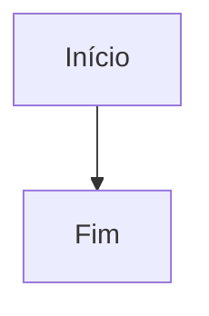

# Teste de renderização Mermaid (arquivo temporário — pode apagar)

## Bloco 1 — `graph TD` (sintaxe mais antiga/universal)

## Bloco 2 — `flowchart LR` (sintaxe moderna)

:::mermaid
flowchart LR
    C --> D
:::
