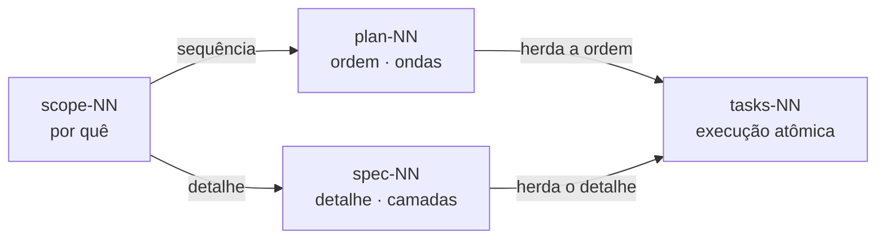

# Framework de Entregas do Projeto Nexus Core

| | |
| --- | --- |
| **Tipo** | Referência |
| **Status** | Aprovado |
| **Versão** | 2.10 — 29/05/2026 |
| **Projeto** | Nexus Core — Hub de Empregabilidade da Recolokey |

O projeto Nexus Core é dividido em **blocos de entrega incremental**. Cada bloco passa por
**4 fases** sequenciais. O projeto como um todo tem documentos mestres que vivem em dois
níveis: **projeto** (transversal a todas as sprints) e **sprint** (recorte de uma sprint
específica).

Os documentos seguem um gradiente **estratégico → tático → operacional**, classificados por
três perguntas fundamentais:

| Pergunta | Documentos | Tom | Peso |
|----------|------------|-----|------|
| **Por quê?** | `overview.md` + `scope-NN.md` | Estratégico | Negócio pesado, Tecnologia presente — foco em visão, decisões e justificativas |
| **O quê?** | `plan-NN.md` | Tático | Negócio + Tecnologia equilibrados — foco em atividades, dependências e sequenciamento |
| **Como?** | `spec-NN.md` + `tasks-NN.md` + `guide-NN.md` | Operacional | Tecnologia pesada, Negócio presente — foco em detalhamento técnico e execução atômica |

---

## 📋 Documentos Mestres (dualidade projeto-sprint)

Cinco artefatos vivem em **dois níveis hierárquicos**: um no escopo do projeto (transversal,
persistente) e um por sprint (recorte da sprint, vive em `engineering/sprint-XX/`).

| Documento | Variante de projeto | Variante de sprint | Fase | Pergunta | Descrição |
|-----------|---------------------|--------------------|------|----------|-----------|
| `memory.md` | `engineering/memory.md` | `engineering/sprint-XX/memory-XX.md` | 0. Exploração | — | Chuva de ideias e discussões dinâmicas entre agente e humano durante a rodada de exploração. Conteúdo sem estrutura padronizada; temas relacionados podem aparecer separados porque foram tratados em momentos distintos da conversa. Fonte da memória bruta do processo. |
| `proposal.md` | `engineering/proposal.md` | `engineering/sprint-XX/proposal-XX.md` | 0. Exploração | — | Fonte da verdade do que foi discutido e acordado. Conteúdo denso, agrupado por conceito (não por cronologia), sem padrão rígido de redação. Variante de projeto cobre decisões transversais; variante de sprint cobre decisões da sprint. |
| `overview.md` | `engineering/overview.md` | `engineering/sprint-XX/overview-XX.md` | 1. Entendimento | **Por quê?** | Visão macro. Variante de projeto: panorama de tudo que o projeto envolve (negócio + tecnologia + todas as sprints + princípios + aderência ao framework). Variante de sprint: panorama da sprint específica (blocos, dependências, deliverables). |
| `tasks.md` | `pipelines/tasks.md` | `pipelines/sprint-XX/tasks.md` | 3. Gerenciamento | **Como?** | Documento mestre de execução. Variante de projeto: consolida as tasks de todas as sprints. Variante de sprint: índice dos blocos da sprint. |
| `review.md` | `engineering/review.md` | `engineering/sprint-XX/review-XX.md` | 4. Encerramento | — | Documento mestre de encerramento. Consolida o que foi entregue vs o que foi proposto. Variante de projeto: ao final do projeto. Variante de sprint: ao final da sprint. |

---

## 📦 Documentos por Bloco (um conjunto por bloco)

Para cada bloco dentro de uma sprint, seis artefatos são gerados. `NN` no nome do arquivo é o
**número do bloco dentro da sprint atual** (`00`, `01`, `02`, ...) — não confundir com `XX`
que é o número da sprint.

| Documento | Localização | Fase | Pergunta | Tom | Descrição |
|-----------|-------------|------|----------|-----|-----------|
| `scope-NN.md` | `engineering/sprint-XX/<NN>-<slug>/scope-NN.md` | 1. Entendimento | **Por quê?** | Estratégico | O que este bloco cobre, decisões conceituais e suas justificativas, Day 0 previsto. Visão predominantemente de negócio — por que este bloco existe, que problema resolve, que decisões arquiteturais foram tomadas e por quê. A tecnologia aparece como fundamentação, não como protagonista. |
| `plan-NN.md` | `engineering/sprint-XX/<NN>-<slug>/plan-NN.md` | 2. Planejamento | **O quê?** | Tático | O que precisa ser feito para implementar o scope — sequência de atividades, dependências entre elas, responsáveis. Equilíbrio entre negócio e tecnologia: cada atividade conecta a decisão estratégica (de onde veio) com a ação técnica (o que será feito). |
| `spec-NN.md` | `engineering/sprint-XX/<NN>-<slug>/spec-NN.md` | 2. Planejamento | **Como?** | Operacional | Como implementar tecnicamente — schemas, contratos de API, configurações detalhadas, regras de negócio formalizadas em formato consumível por código/IA. Tom predominantemente técnico com referências pontuais ao negócio para manter rastreabilidade. |
| `tasks-NN.md` | `pipelines/sprint-XX/tasks-NN.md` | 3. Gerenciamento | **Como?** | Operacional | Tarefas atômicas derivadas do plan e spec — cada task é uma ação executável por um agente (humano ou IA) sem ambiguidade. Totalmente técnico: comando a executar, arquivo a criar, configuração a aplicar. |
| `guide-NN.md` | `pipelines/sprint-XX/guide-NN.md` | 3. Gerenciamento | **Como?** | Operacional | Mecânica de execução das tarefas — passo a passo, cliques no portal, screenshots, comandos shell exatos. Cada item do guide corresponde a uma ou mais tasks. |
| `handoff-NN.md` | `engineering/sprint-XX/<NN>-<slug>/handoff-NN.md` | 4. Encerramento | — | Reflexivo | Documento de handoff entre blocos (transição de conhecimento e contexto para o bloco seguinte). Captura o que mudou de fato, dívidas reconhecidas, recomendações para o próximo bloco. |

**Convenção de nomenclatura:**

- `XX` = número da **sprint** (01, 02, 03, ...) — aparece no nome do diretório `sprint-XX/`.
- `NN` = número do **bloco** dentro da sprint (00, 01, ..., 09) — aparece no nome dos
  artefatos `scope-NN.md`, `plan-NN.md`, etc. e no diretório do bloco `<NN>-<slug>/`.
- `<slug>` = identificador *kebab-case* em inglês do bloco. Regra prescritiva
  completa (formato, dois contextos cobertos, exemplos correto/incorreto,
  justificativa): ver
  [rules.md § Slug de Diretórios em Inglês](../instructions/foundations/rules.md).

Exemplo concreto: o bloco `02-enriquecimento-validacao-endereco` da Sprint 01 produz:

- `engineering/sprint-01/02-enriquecimento-validacao-endereco/scope-02.md`
- `engineering/sprint-01/02-enriquecimento-validacao-endereco/plan-02.md`
- `engineering/sprint-01/02-enriquecimento-validacao-endereco/spec-02.md`
- `engineering/sprint-01/02-enriquecimento-validacao-endereco/handoff-02.md`
- `pipelines/sprint-01/tasks-02.md`
- `pipelines/sprint-01/guide-02.md`

**Documento de orquestração (`kickoff-NN.md`).** Além dos seis
artefatos acima — que carregam o **conteúdo** do funil —, cada bloco
tem um `kickoff-NN.md` em `engineering/sprint-XX/<NN>-<slug>/`. Ele
**não é um nível do funil**: é um documento de orquestração que
encadeia as janelas de criação dos artefatos (uma seção de invocação
por janela: `scope` → `plan` → `spec` → `tasks` → `guide`), entregando
ao agente de cada janela o **contexto** para trabalhar sem prescrever a
solução. Vem **antes** do trabalho — não confundir com o
`handoff-NN.md`, que vem **depois** (Encerramento). O `kickoff-NN.md`
nasce com a primeira janela (`scope`) e se auto-perpetua: o último
prompt de cada janela cria a seção da janela seguinte. Template:
[`templates/workflow/kickoff.md`](../templates/workflow/kickoff.md).

---

## 🎯 Altitude de Decisão — onde cada decisão fecha

Toda decisão tem um **lar canônico** no funil, definido pela sua **altitude** — o quão
conceitual ou detalhada ela é —, não pelo seu **domínio** (negócio ou tecnologia). A tecnologia
atravessa as altitudes: a decisão **arquitetural** fecha no `scope`, a decisão de **detalhe** fecha
no `spec`.

| Altitude da decisão | Fecha em | Pergunta | Exemplos |
| --- | --- | --- | --- |
| Conceitual / de negócio | `scope-NN.md` | Por quê? | O que o bloco entrega, *Landing Zone* imutável, proteger dados pessoais |
| Arquitetural (inclusive de tecnologia) | `scope-NN.md` | Por quê? | Hub & Spoke, 4 *Solutions*, criptografia de campo, fila + tópico |
| Técnica de detalhe / configuração | `spec-NN.md` | Como? | Tamanho da chave, *sessions* ligadas ou não, cadência de rotação, *schema* de tabela |
| Sequência, dependência, propriedade | `plan-NN.md` | O quê? | Ordem das atividades, "X antes de Y", responsável Arquiteto ou Técnico |

O `plan-NN.md` **decide pouco, por desenho**: ele **sequencia** as decisões do `scope` e atribui
responsáveis — não rejustifica decisões (papel do `scope`) nem detalha configurações (papel do
`spec`).

**Decisão de detalhe que condiciona o desenho.** Uma decisão técnica de detalhe pode aparecer
**como pendência sinalizada** no `scope-NN.md` (§ Decisões em Aberto) quando bloqueia o desenho do
Day 0 — mas o seu **fechamento canônico** é no `spec-NN.md`. Ao ser resolvida, sai das Decisões em
Aberto do `scope` e o valor desce para o `spec`.

---

## 🔗 Como os Artefatos do Bloco se Encaixam

Os artefatos do bloco dividem a definição do trabalho ao longo de **dois eixos** que só se
encontram no `tasks`: um eixo de **detalhe** (`scope → spec → tasks`) e um eixo de **sequência**
(`plan → tasks`). Daí a dúvida comum — "o `plan` e o `spec` não são redundantes?". Não são:
respondem a perguntas diferentes e **não compartilham conteúdo**. A confusão vem de pensar o
`spec` como "um `plan` mais detalhado" — não é: são tipos de conteúdo distintos, em eixos
distintos.

Numa analogia de obra: o `scope` é o briefing ("casa de três quartos, porque…"); o `plan` é o
**cronograma** (fundação na semana 1, elétrica antes do gesso, quem faz cada etapa); o `spec` é a
**planta / projeto executivo** (fundação de concreto de 30 cm, fiação de 2,5 mm²); o `tasks` é a
**ordem de serviço** diária (segunda: concretar o trecho A conforme a planta, seguindo o
cronograma). O pedreiro precisa dos dois — o cronograma dá a ordem, a planta dá as medidas.

| Artefato | Pergunta | Conteúdo | NÃO contém |
| --- | --- | --- | --- |
| `scope-NN.md` | Por quê? | Decisões e justificativas | Sequência, *schema*, comandos |
| `plan-NN.md` | O quê + quando? | Atividades ordenadas, dependências, responsável | Detalhe técnico (*schema*, config) |
| `spec-NN.md` | Como? | *Schemas*, contratos, configurações, regras | Ordem, dependências, responsável |
| `tasks-NN.md` | Executar | Tarefas atômicas executáveis | (junta o `plan` e o `spec`) |

O ponto que mais gera dúvida: **o `tasks-NN.md` é construído a partir do `plan` E do `spec`** (ver
Fase 3 — "tarefas atômicas derivadas do plan e spec"). Cada tarefa atômica herda a **ordem** do
`plan` e o **detalhe** do `spec` — é onde os dois eixos se encontram:



Concretamente, sobre a tabela `hbe_AdviseeRegistration`: o `plan` diz "criar a tabela em
`hbe_core`, depois das *Solutions*, pelo Implantador (Técnico)"; o `spec` diz "estas colunas e
tipos, chave alternativa `hbe_CorrelationId` indexada, *Column Security* nas colunas de dados
pessoais — o *schema* completo". Nenhum contém a informação do outro; o `tasks` os funde numa
tarefa executável. Tente seguir só o `plan` (não se sabe o *schema*) ou só o `spec` (não se sabe a
ordem nem quem executa): falta sempre uma metade.

A consequência dessa divisão na **forma** de cada artefato está na seção seguinte.

---

## 🧱 Estrutura por Artefato

A estrutura de seções H2 de cada artefato segue o eixo a que ele pertence (ver a seção anterior).
No eixo de **detalhe**, o `scope` e o `spec` **decompõem por camada** — então usam as 7 camadas
como H2. No eixo de **sequência**, o `plan` **decompõe por tempo** — então usa Ondas de Execução
como H2.

| Artefato | Estrutura (H2) | Eixo |
| --- | --- | --- |
| `scope-NN.md` | 7 camadas | Detalhe (por camada) |
| `plan-NN.md` | Ondas de Execução | Sequência (por tempo) |
| `spec-NN.md` | 7 camadas | Detalhe (por camada) |

No `plan-NN.md` as camadas não desaparecem: cada atividade carrega o prefixo da sua camada de
origem (`A-GOV`, `A-INF`, `A-SEC`…) e o **Mapa de Rastreabilidade Scope → Plan** garante a
cobertura camada a camada, preservando o *cross-check* vertical do funil. Os artefatos que
decompõem por camada (`scope`, `spec`, `handoff`) mantêm as sete camadas — Governança,
Arquitetura, Infraestrutura, Dados, Segurança, Aplicação e Automação — como seções H2 fixas.

---

## 🔻 Modelo de Funil — Coerência Vertical entre Artefatos

Esta seção define a **regra estrutural mais importante** do framework: como o conteúdo flui
e se preserva ao longo dos artefatos. É o que garante que **nenhuma decisão se perca** entre
a discussão inicial e a execução final.

### Por que existe este modelo

Sem uma regra explícita, o que costuma acontecer em projetos complexos:

- Conceitos discutidos no início da exploração se perdem ao longo das condensações sucessivas.
- O documento operacional final (guide) reflete uma fração das decisões originais.
- Surgem **órfãos verticais** — conteúdo num nível operacional que não tem âncora no nível
  conceitual (de onde veio essa decisão?) ou conceito num nível estratégico sem
  materialização no nível operacional (onde isso vai ser implementado?).
- A rastreabilidade entre "o que decidimos" e "o que foi feito" colapsa.

O modelo do funil resolve isso impondo **coerência vertical estrita**: cada nível de
artefato é um **subconjunto coberto** pelo nível imediatamente inferior. O que entrou no
topo do funil tem que sair pelo fundo. Zero perdas, zero invenções.

### Os sete níveis do funil

Do mais macro ao mais micro:

| Nível | Artefato | Granularidade | Origem do conteúdo | Destino para o nível abaixo |
|-------|----------|---------------|--------------------|-----------------------------|
| 1 | `memory.md` | Caos narrativo, cronológico | Discussão agente-humano em tempo real | Consolidado em `proposal.md` |
| 2 | `proposal.md` | Tabular, denso, agrupado por conceito | Consolidação do `memory.md` | Abstraído em `overview.md` |
| 3 | `overview.md` | Panorâmico, conceitual | Síntese do `proposal.md` + canvases + Kit | Particionado em `scope-NN.md` por bloco |
| 4 | `scope-NN.md` | Recorte funcional do bloco | Pedaço do `overview.md` materializado em um bloco | Detalhado em `spec-NN.md` |
| 5 | `spec-NN.md` | Detalhe técnico operacional | Tradução técnica do `scope-NN.md` | Atomizado em `tasks-NN.md` |
| 6 | `tasks-NN.md` | Ações atômicas, executáveis | Cada item do `spec-NN.md` vira N tarefas | Mecanizado em `guide-NN.md` |
| 7 | `guide-NN.md` | Cliques, comandos, capturas | Cada task ganha sua mecânica de execução | — (nível final) |

### Os três movimentos do funil

O fluxo de cima para baixo (do nível 1 ao 7) não é uniforme — passa por **três movimentos
qualitativamente distintos**.

#### Movimento 1 — Consolidação (memory → proposal)

A discussão entre agente e humano produz um registro caótico, narrativo, cronológico no
`memory.md`. Temas relacionados podem aparecer separados porque foram tratados em momentos
distintos da conversa. Decisões iniciais podem ser revertidas mais adiante, mas ambas as
versões coexistem na memória.

A **consolidação** retira o ruído da discussão (idas e vindas, mudanças de opinião,
hesitações) e organiza o conteúdo por **conceito**, não por **cronologia**. O `proposal.md`
emerge denso, tabular, agrupado. Mesmo conteúdo conceitual; estrutura totalmente diferente.

Característica chave: **o `proposal.md` é mais curto que o `memory.md`**, porque remove o
ruído narrativo. Mas é mais **denso** — cada parágrafo carrega mais decisão por linha.

#### Movimento 2 — Abstração (proposal → overview)

O `proposal.md` registra decisões em alto detalhe (listas completas, schemas, tabelas
exaustivas). O `overview.md` sobe um degrau de abstração: **princípios** e **mapa
panorâmico** ganham primazia; **detalhes operacionais** cedem espaço.

O `overview.md` responde à pergunta "**o que é o projeto e por que ele existe?**" enquanto o
`proposal.md` responde "**o que decidimos especificamente?**". Ambos partilham o mesmo
conteúdo conceitual, mas em níveis diferentes de zoom.

Característica chave: **o `overview.md` pode ser mais longo** que o `proposal.md` quando
incorpora também canvases de negócio, Kit de Engenharia e roadmap de sprints — fontes
externas à rodada de discussão atual. Mas seu **tom é mais panorâmico**, menos detalhista.

#### Movimento 3 — Granularização (overview → scope → spec → tasks → guide)

A partir do `overview.md`, o conteúdo desce em granularidade através de quatro níveis:

- `scope-NN.md` recorta uma **fatia funcional** do overview e a materializa num bloco.
- `spec-NN.md` traduz a fatia em **detalhe técnico operacional** (schemas, configurações).
- `tasks-NN.md` atomiza o spec em **ações executáveis sem ambiguidade**.
- `guide-NN.md` instrumenta as tasks com **mecânica de execução** (cliques, comandos).

A cada degrau, o nível anterior é **expandido em detalhe**. Nada de novo aparece no nível
abaixo que não estivesse esboçado no nível acima — apenas o **detalhamento** se intensifica.

### A regra do subconjunto (não-negociável)

Esta é a regra estrutural que sustenta o modelo:

> **Nada num nível superior do funil pode estar ausente do nível imediatamente inferior.**
> **Nada num nível inferior pode aparecer sem ter origem no nível imediatamente superior.**

Formalizado:

- Todo conceito em `proposal.md` precisa ter origem em `memory.md`.
- Todo conceito em `overview.md` precisa estar coberto por `proposal.md` (na variante
  correspondente: projeto cobre projeto; sprint cobre sprint).
- Todo conceito em `overview.md` precisa ser materializado em pelo menos um `scope-NN.md` —
  caso contrário, é uma promessa sem entrega.
- Todo item em `scope-NN.md` precisa ter detalhe técnico em `spec-NN.md` do mesmo bloco.
- Toda decisão técnica em `spec-NN.md` precisa virar uma ou mais ações em `tasks-NN.md`.
- Todo passo de execução em `guide-NN.md` precisa ter origem em alguma task em `tasks-NN.md`.

A cadeia completa: **o que entrou no `proposal.md` tem que sair em algum `guide-NN.md`**. Se
um conceito do proposal não chega à execução, ou foi esquecido (bug) ou foi removido
intencionalmente (deve ser marcado como "fora do escopo" com justificativa).

### Dualidade projeto-sprint nos níveis 2 e 3

Os níveis 2 (`proposal`) e 3 (`overview`) vivem em **dois níveis hierárquicos**: projeto e
sprint. Isso não é redundância — é particionamento de escopo.

| Aspecto | Variante de projeto | Variante de sprint |
|---------|---------------------|--------------------|
| Localização | `engineering/proposal.md` e `engineering/overview.md` | `engineering/sprint-XX/proposal-XX.md` e `engineering/sprint-XX/overview-XX.md` |
| Escopo | Decisões transversais a todas as sprints | Decisões específicas da sprint XX |
| Conteúdo típico | Princípios arquiteturais, naming, gestão do ciclo de vida da aplicação (*Application Lifecycle Management*, ALM), modelo de dados conceitual, roadmap macro, conformidade com a Lei Geral de Proteção de Dados (LGPD) | Os N blocos da sprint, F-Codes endereçados, dependências internas, deliverables esperados |
| Ciclo de vida | Vive enquanto o projeto vive; atualizado quando decisão transversal muda | Inaugurado no início da sprint; congelado quando a sprint encerra |
| Subconjunto vertical | Cobre o `overview.md` de projeto | Cobre o `overview-XX.md` da sprint |

**Regra adicional:** o `proposal-XX.md` da sprint precisa ser **subconjunto** ou **extensão
compatível** do `proposal.md` de projeto. Decisões de sprint não podem violar decisões de
projeto — apenas particularizá-las ou adicionar detalhe pertinente à sprint.

O mesmo vale para `memory.md`: pode haver `engineering/memory.md` (memória de discussões
transversais) e `engineering/sprint-XX/memory-XX.md` (memória da discussão de uma sprint
específica).

### Cross-check vertical — como validar a coerência

Sempre que um nível é alterado, executa-se **cross-check vertical** com o nível adjacente
para detectar discrepâncias. O procedimento, formalizado:

1. **Enumere os conceitos** do nível superior.
2. **Para cada conceito**, localize sua âncora no nível inferior (com link Foam idealmente).
3. **Marque três estados**:
   - ✅ Cobertura completa — conceito tem âncora explícita no nível inferior.
   - ⚠️ Cobertura parcial — conceito mencionado mas sem detalhe esperado.
   - 🟥 Órfão — conceito sem âncora; bug a resolver.
4. **Resolva os órfãos** antes de avançar para o próximo nível ou bloco.

O mesmo procedimento, na direção inversa (de baixo para cima):

1. **Enumere os itens** do nível inferior.
2. **Para cada item**, localize sua origem no nível superior.
3. **Marque** itens sem origem como órfãos invertidos — surgiram do nada.
4. **Resolva**: ou ancorar no nível superior (adicionando o conceito), ou remover o item
   (não tem justificativa para existir).

Este cross-check foi a metodologia usada para alinhar `memory.md` e `proposal.md` durante a
rodada de exploração da Sprint 01 — formalizado aqui para uso futuro.

### Anti-patterns a evitar

| Anti-pattern | Sintoma | Resolução |
|--------------|---------|-----------|
| **Salto de nível** | `overview` materializado direto em `tasks-NN.md` sem passar por `scope-NN.md` e `spec-NN.md`. | Reconstituir os níveis intermediários antes de seguir. |
| **Órfão descendente** | Conteúdo num nível inferior que não tem origem no nível superior. | Ancorar ou remover. |
| **Órfão ascendente** | Conceito num nível superior que não é materializado em nenhum nível inferior. | Materializar num bloco ou marcar como "fora do escopo". |
| **Condensação prematura** | Reescrever `overview.md` reduzindo conteúdo do `proposal.md` sem preservar o "porquê" das decisões. | Manter a profundidade conceitual; reduzir detalhes operacionais, não contexto. |
| **Divergência projeto-sprint** | `proposal-XX.md` da sprint introduz decisão que contradiz `proposal.md` do projeto. | Alinhar: ou ajusta o de projeto (se a decisão é transversal), ou desfaz no de sprint (se viola convenção). |
| **Categorização inconsistente** | Mesmo item categorizado como "decisão em aberto" num arquivo e "tarefa pendente" em outro. | Alinhar categorização entre os arquivos. |
| **Esquecimento na granularização** | Conceito presente no `scope-NN.md` que some no `spec-NN.md`. | Cross-check antes de avançar de fase. |

### Exemplo prático — rastreando "Cadastro Assessorado cifrado" do funil inteiro

Para ilustrar a coerência vertical, segue a trajetória de uma decisão única do topo ao
fundo do funil:

**1. `memory.md` (chuva de ideias):**

> "Nó 1.d sobre Cadastro Assessorado: informação de identificação pessoal (*Personally
> Identifiable Information*, PII) em claro ou cifrada? Resposta do Arquiteto: criptografada.
> Não faz sentido um System Admin do Azure ler dados pessoais no Service Bus."

**2. `proposal.md` de projeto (consolidação):**

> "Princípio 4: informação de identificação pessoal (*Personally Identifiable Information*,
> PII) protegida em dois níveis complementares. Em trânsito pelo Azure Service Bus:
> criptografia de campo via Azure Key Vault (RSA-OAEP-256). Em repouso no Microsoft
> Dataverse: Field-Level Security via Column Security Profiles."

**3. `overview.md` de projeto (abstração):**

> "O Hub adota proteção da Lei Geral de Proteção de Dados (LGPD) em duas camadas
> complementares. A informação de identificação pessoal (*Personally Identifiable
> Information*, PII) trafega cifrada pelo broker e fica protegida por Column-Level
> Security em repouso. Operadores comuns nunca veem os dados em claro — apenas perfis
> autorizados via Column Security Profile."

**4. `overview-01.md` da Sprint 01 (recorte de sprint):**

> "A Sprint 01 entrega a primeira materialização da estratégia de proteção da informação
> de identificação pessoal (*Personally Identifiable Information*, PII) do projeto.
> O Cadastro Assessorado (`hbe_AdviseeRegistration`) é a landing zone imutável onde os
> dados persistem **cifrados**; sua decifragem para `Contact` ocorre apenas após
> verificações OK, sob Column Security Profile."

**5. `scope-00.md` (Bloco 00 — Fundamentos):**

> "Este bloco entrega a fundação da estratégia de criptografia: provisiona o Azure Key
> Vault, cria a chave `key-pii-data` (RSA 2048), atribui controle de acesso baseado em
> papéis (*Role-Based Access Control*, RBAC) ao Service Principal, e
> implementa o `fl-service-crypto-handler` que encapsula encrypt/decrypt para uso por
> todos os blocos subsequentes."

**6. `spec-00.md` (Bloco 00):**

> "Chave: nome `key-pii-data`, tipo RSA, tamanho 2048 bits, operações `encrypt` + `decrypt`,
> sem expiração em DEV. Algoritmo: RSA-OAEP-256. Service Principal `sp-hbe-dev-keyvault`
> com roles `Key Vault Crypto User` + `Key Vault Secrets User`. ..."

**7. `tasks-00.md` (Bloco 00 em `pipelines/sprint-01/`):**

> "T2.3: Criar chave `key-pii-data` no Key Vault. T2.4: Atribuir role `Key Vault Crypto
> User` ao Service Principal. T2.5: ..."

**8. `guide-00.md` (Bloco 00 em `pipelines/sprint-01/`):**

> "Acesse Azure Portal → Key Vault `kv-hbe-dev` → Keys → Generate/Import → preencha: Name
> = `key-pii-data`, Key type = RSA, RSA key size = 2048 → Create. Validar que Permitted
> Operations inclui Encrypt e Decrypt."

A decisão original ("PII cifrado no broker") percorre **8 artefatos** ganhando granularidade
a cada passo. Nada se perde; cada nível é subconjunto coberto pelo nível inferior. Da
discussão inicial à mecânica de cliques no Portal Azure, a rastreabilidade é total.

### Implicação para agentes

Ao **criar** qualquer artefato, o agente DEVE:

1. Identificar o nível do artefato no funil.
2. Localizar o artefato do nível imediatamente superior.
3. Para cada conceito que vai incluir, validar que ele tem âncora no nível superior.
4. Para cada conceito do nível superior, validar que pelo menos um conceito do novo
   artefato o materializa (quando aplicável — alguns conceitos atravessam múltiplos blocos).

Ao **revisar** um artefato, o agente DEVE:

1. Executar cross-check vertical com o nível superior e com o nível inferior (quando
   ambos existem).
2. Identificar órfãos descendentes e ascendentes.
3. Resolver órfãos antes de aprovar.

Ao **atualizar** um artefato em qualquer nível, o agente DEVE:

1. Identificar quais níveis abaixo são afetados pela mudança.
2. Propagar a alteração para cada nível afetado.
3. Re-executar cross-check vertical em cascata.

O `memory.md` é a única **exceção**: ele acumula tudo sem regra de coerência. Mas a partir
dele, todo nível abaixo precisa seguir a regra do subconjunto.

---

## 🔄 As 4 Fases

### 🧭 Fase 1 — Entendimento

**Objetivo:** Definir *por que* o projeto e cada sprint existem — visão estratégica e
decisões conceituais.

**Tom:** Estratégico — negócio pesado, tecnologia presente como fundamentação.

Esta fase opera em dois níveis:

**Nível Projeto (uma vez):**

- **Entrada:** Discussões exploratórias com a IA para mapear possibilidades de implantação,
  restrições, personas, estratégia de ondas.
- **Saída:** `overview.md` (e indiretamente `proposal.md` + `memory.md`) — documento mestre
  com visão geral de todos os blocos.
- **Quality gate:** Arquiteto de Soluções (Humano) aprova o overview.

**Nível Bloco (a cada bloco):**

- **Entrada:** `overview.md` e/ou `overview-XX.md` (como guia).
- **Saída:** `scope-NN.md` — conceito + decisões para o bloco específico.

---

### 📋 Fase 2 — Planejamento

**Objetivo:** Definir *o que* precisa ser feito (`plan`) e *como* tecnicamente (`spec`) para
implementar as decisões do scope.

**Tom:** Tático no plan (negócio + tecnologia equilibrados), operacional no spec (tecnologia
pesada, negócio como referência).

**Entradas:**

- `scope-NN.md` aprovado

**Saídas:**

- `plan-NN.md` — sequência de atividades e dependências
- `spec-NN.md` — detalhamento técnico

---

### ⚙️ Fase 3 — Gerenciamento

**Objetivo:** Gerar as tasks, executar as tasks e validar a execução.

**Tom:** Operacional — totalmente técnico. Cada task é uma ação atômica executável sem
ambiguidade.

Esta fase opera em **dois sub-gates sequenciais**:

**Artefato Tasks (documento):**

- **Entrada:** `plan-NN.md` + `spec-NN.md` aprovados
- **Saída:** `tasks.md` incremental + `tasks-NN.md` + `guide-NN.md` — lista de tarefas
  atômicas derivadas do plan e spec, com mecânica de execução.

**Artefato Validation (execução prática):**

- **Entrada:** `tasks-NN.md` aprovado + execução concluída
- **Atividade:** O auditor executa comandos de verificação no ambiente real; o revisor
  avalia valor entregue e prontidão para uso.

---

### 🏁 Fase 4 — Encerramento

**Objetivo:** Consolidar o que foi entregue na sprint como um todo.

**Saídas:**

- `handoff-NN.md` por bloco — transição para o bloco seguinte.
- `review-XX.md` da sprint — comparação proposto (`overview-XX.md`) vs entregue (tasks da
  sprint). Lições aprendidas, dívidas reconhecidas, recomendações para a próxima sprint.

**Quando:** Ao final de cada sprint (não a cada bloco). Os blocos alimentam o review
incrementalmente.

---

## ✅ Validação Técnica dos Artefatos

Toda alteração em arquivo `.md` percorre **dois eixos de validação complementares**,
transversais às 4 fases acima — qualquer artefato do funil (scope, plan, spec, tasks,
guide, handoff) passa pelo mesmo pipeline antes de ser aprovado:

- **Conformidade (`[Compliance]`)** — aderência a regras prescritivas escritas:
  *frontmatter* contra `schema.yml`, sintaxe Markdown (regras MD###), terminologia,
  diagramas Mermaid, contrato de tarefas.
- **Qualidade (`[Quality]`)** — integridade emergente do conteúdo: *links* internos
  resolvem, ortografia limpa.

Procedimento canônico end-to-end (do *edit* ao ✅, incluindo ordem de execução,
tratamento de FAIL e atalhos): [`docs/operation/process-validation.md`](operation/process-validation.md).
Prompts prontos para colar em janela de Validador
(`validate-compliance-file`, `validate-quality-file`, `validate-all`,
`validate-llm-protocol`, `triage-cspell`, `validate-block-complete`):
[`docs/operation/invocations-validation.md`](operation/invocations-validation.md).

---

## 🔁 Mecanismo de melhoria contínua

O Nexus Core mantém um *backlog* de achados e iniciativas de melhoria do
próprio *framework* em [improvements/](../improvements/). O mecanismo
opera independente do ciclo de *delivery* dos blocos do projeto e segue
três passos:

1. **Captura** — achados detectados durante qualquer rodada de trabalho
   (criação de artefato, validação, *debug*) são parqueados em
   [improvements/backlog.md](../improvements/backlog.md) sem perder o foco
   da iniciativa em curso.
2. **Promoção** — quando priorizados pelo Arquiteto de Soluções (Humano),
   achados do *backlog* viram iniciativas dedicadas em
   `improvements/<slug>/`. Cada iniciativa contém, no mínimo, `plan.md`
   (plano de execução) e `memory.md` (memória incremental das interações).
3. **Encerramento** — a iniciativa é promovida a `closed` quando suas
   mudanças entram em vigor no *framework*; o `memory.md` preserva o
   histórico de raciocínio.

O mecanismo operacional está auto-documentado em
[improvements/backlog.md](../improvements/backlog.md); a formalização
prescritiva virá pela iniciativa de convenção da fase de Ideação, achado
parqueado no próprio *backlog*.

---

## 🚀 Day 0 e Day 1 — Definições

**Day 0** é a seção prática de implementação que **todo escopo deve ter**. É o "mão na
massa" que transforma o conceito do escopo em realidade — configurações remotas (ADO, Azure,
SharePoint) e configurações locais (máquina do Implantador). Sem Day 0, não há validação;
sem validação, avançamos com premissas não testadas.

**Day 1** é **exclusivo do Bootstrap**. É o momento em que o **Operador** (persona do time
operacional, não o Implantador) faz onboarding num sistema 100% funcional para começar a
operar. Não é validação — é início de operação real.

| Conceito | Quando | Quem | O que faz |
|----------|--------|------|-----------|
| **Day 0** | Em todo bloco (Fase 3) | Implantador | Materializa as decisões do scope — cria recursos, instala ferramentas, configura ambientes |
| **Day 1** | Apenas no Bootstrap | Operador | Faz onboarding no sistema completo — instala stack, clona repos, executa handshake, recebe primeira demanda |

---

## ♻️ Ciclo de Vida de um Bloco

```mermaid
flowchart LR
    subgraph BLOCO["BLOCO NN"]
        A1["**ARTEFATO**<br/>Scope<br/>---<br/>scope-NN.md"]
        A2["**ARTEFATO**<br/>Plan<br/>---<br/>plan-NN.md"]
        A3["**ARTEFATO**<br/>Spec<br/>---<br/>spec-NN.md"]
        A4["**ARTEFATO**<br/>Tasks<br/>---<br/>tasks-NN.md<br/>+ guide-NN.md"]
        A5["**ARTEFATO**<br/>Validation<br/>---<br/>Day 0<br/>Execução"]
        A6["**ARTEFATO**<br/>Handoff<br/>---<br/>handoff-NN.md"]

        G1{"**REVIEW**"}
        G2{"**REVIEW**"}
        G3{"**REVIEW**"}
        G4{"**REVIEW**"}
        G5{"**REVIEW**"}
        G6{"**REVIEW**"}

        PB(["Próximo bloco"])

        A1 --> G1
        G1 -- "Seguir ✅" --> A2
        G1 -- "🟥<br/>Corrigir" --> A1

        A2 --> G2
        G2 -- "Seguir ✅" --> A3
        G2 -- "🟥<br/>Corrigir" --> A2

        A3 --> G3
        G3 -- "Seguir ✅" --> A4
        G3 -- "🟥<br/>Corrigir" --> A3

        A4 --> G4
        G4 -- "Seguir ✅" --> A5
        G4 -- "🟥<br/>Corrigir" --> A4

        A5 --> G5
        G5 -- "Seguir ✅" --> A6
        G5 -- "🟥<br/>Corrigir" --> A5

        A6 --> G6
        G6 -- "Seguir ✅" --> PB
        G6 -- "🟥<br/>Corrigir" --> A6
    end
```



---

## 📜 Regras Universais para Agentes

Todo agente que opera workflows neste repositório DEVE carregar e seguir as instruções
consolidadas em [`instructions/orchestrator.md`](../instructions/orchestrator.md).

O `orchestrator.md` é o ponto de entrada que define:

- **Regras universais** em
  [`instructions/foundations/rules.md`](../instructions/foundations/rules.md):
  leitura obrigatória do framework, versionamento, confirmação de commit,
  links Foam, padrões Markdown, slug em inglês para workflows, entre outras.
- **Diretrizes comportamentais** em
  [`instructions/foundations/directives.md`](../instructions/foundations/directives.md):
  idioma PT-BR, tom editorial, menus numerados como interface padrão.
- **Padrões operacionais** em
  [`instructions/foundations/standards.md`](../instructions/foundations/standards.md):
  uso de templates, pre-flight check, double check, transparência de falhas,
  Git nativo, task lists por fase do workflow, gates inter-fase, menu numerado,
  **fidelidade a comandos e patterns do spec**.
- **Pipelines de validação** em [`gates/compliance.md`](../gates/compliance.md) (gates
  `[Compliance]`: frontmatter, lint Markdown, terminologia, contrato de tarefas, estrutural)
  e [`gates/quality.md`](../gates/quality.md) (gates `[Quality]`: links órfãos, ortografia).
- **Padrões de sintaxe Markdown** em
  [`instructions/writing/markdown.md`](../instructions/writing/markdown.md).
- **Padrões de terminologia** (inline code, itálico, pareamento bilíngue, expansão de siglas) em
  [`instructions/writing/terminology.md`](../instructions/writing/terminology.md).
- **Contrato de execução e validação de tarefas** em
  [`instructions/contracts/tasks.md`](../instructions/contracts/tasks.md):
  modelo de 5 estados, convenção de actor labels `[Executor]`/`[Validador]`, sequência
  canônica.

### Aplicabilidade

Todas as instruções acima se aplicam **integralmente** a todos os agentes operando neste
projeto, com uma adaptação: as fases 0–7 originalmente desenhadas para workflow de
**criação de conteúdo editorial** são substituídas pelo modelo de **4 fases por bloco**
descrito neste documento. O agente segue o modelo das 4 fases (Entendimento → Planejamento
→ Gerenciamento → Encerramento) para a execução prática dos blocos.

Além das instruções, o agente DEVE respeitar a **regra do subconjunto** do modelo do funil
descrito acima — esta é a regra estrutural específica deste projeto.

---

## 📁 Estrutura de Diretórios do Projeto

```text
hbe/
├── docs/                          # Documentação geral do projeto
│   ├── business/                   # Visão de negócio
│   │   └── canvas/                # Bizz Project Canvas (artefatos migrados)
│   ├── technology/
│   │   ├── executive/
│   │   │   └── canvas/            # Tech Project Canvas (artefatos migrados)
│   │   └── technical/
│   │       └── engineering/       # Artefatos técnicos de engenharia
│   │           ├── memory.md      # Memory do projeto (chuva de ideias)
│   │           ├── proposal.md    # Proposal do projeto (decisões transversais)
│   │           ├── overview.md    # Overview do projeto (visão panorâmica)
│   │           ├── review.md      # Review do projeto (consolidação final)
│   │           ├── 01-global-governance/
│   │           ├── 02-tactical-specification/
│   │           └── sprint-XX/     # Por sprint
│   │               ├── memory-XX.md       # Memory da sprint
│   │               ├── proposal-XX.md     # Proposal da sprint
│   │               ├── overview-XX.md     # Overview da sprint
│   │               ├── review-XX.md       # Review da sprint
│   │               └── <NN>-<slug>/       # Por bloco
│   │                   ├── scope-NN.md
│   │                   ├── plan-NN.md
│   │                   ├── spec-NN.md
│   │                   └── handoff-NN.md
│   └── workflow.md                # Este documento
├── instructions/                  # Instruções universais para agentes
│   ├── orchestrator.md
│   ├── foundations/
│   ├── writing/
│   ├── contracts/
│   └── taxonomy/
├── gates/                         # Pipelines de validação dos gates
│   ├── compliance.md              # Gates [Compliance]
│   └── quality.md                 # Gates [Quality]
├── pipelines/                     # Documentos práticos de execução
│   ├── tasks.md                   # Master de todas as sprints
│   └── sprint-XX/                 # Por sprint
│       ├── tasks.md               # Master da sprint
│       ├── tasks-NN.md            # Tasks do bloco NN
│       └── guide-NN.md            # Guide do bloco NN
├── scripts/                       # Scripts dos gates
│   └── gates/                     # compliance.py, quality.py
├── templates/                     # Templates de artefato
├── assets/                        # PDFs, imagens, recursos
├── .markdownlint.json             # Config [Compliance] Lint Markdown
├── cspell.json                    # Config [Quality] Verificação Ortográfica
└── package.json                   # Dependências Node (markdownlint-cli2, cspell)
```

---

## 🗂️ Estrutura de Diretórios na Sprint (exemplo: Sprint 01)

```text
docs/technology/technical/engineering/sprint-01/
├── memory-01.md                   # Memory da Sprint 01 (opcional)
├── proposal-01.md                 # Proposal da Sprint 01
├── overview-01.md                 # Overview da Sprint 01
├── review-01.md                   # Review da Sprint 01 (no encerramento)
│
├── 00-fundamentos/                # Bloco 00
│   ├── scope-00.md
│   ├── plan-00.md
│   ├── spec-00.md
│   └── handoff-00.md
│
├── 01-enriquecimento-validacao-pessoal/    # Bloco 01
│   ├── scope-01.md
│   ├── plan-01.md
│   ├── spec-01.md
│   └── handoff-01.md
│
└── ...                            # demais blocos da Sprint 01

pipelines/sprint-01/
├── tasks.md                       # Master da Sprint 01 (índice dos blocos)
├── tasks-00.md                    # Tasks do Bloco 00
├── guide-00.md                    # Guide do Bloco 00
├── tasks-01.md
├── guide-01.md
└── ...                            # demais tasks/guides da Sprint 01
```
